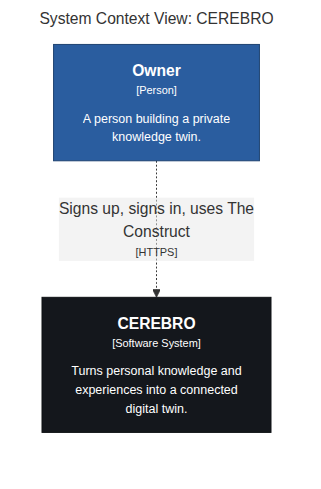
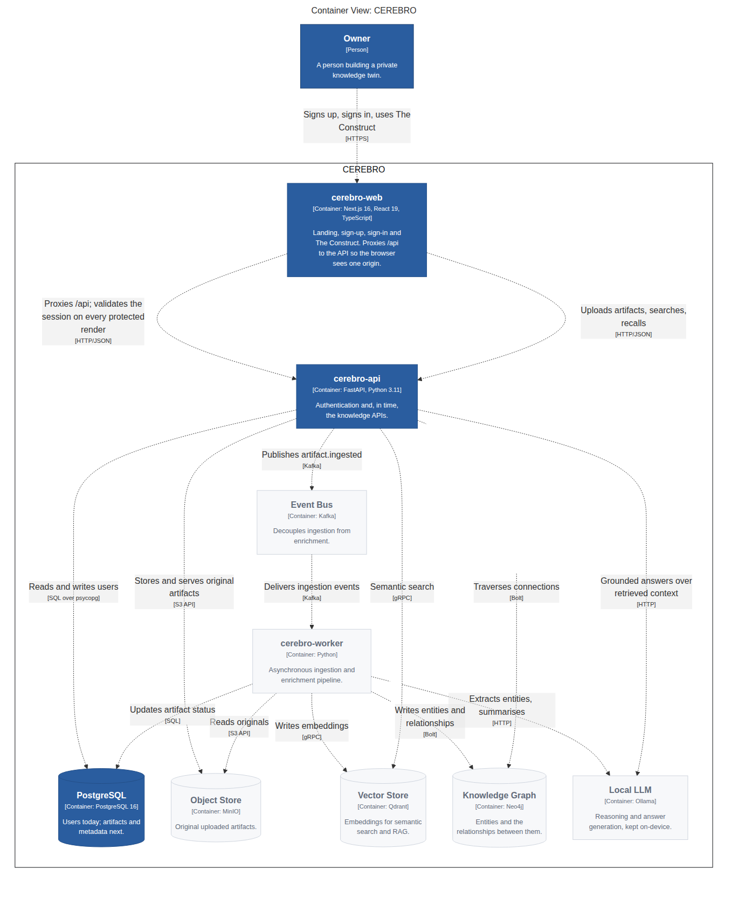
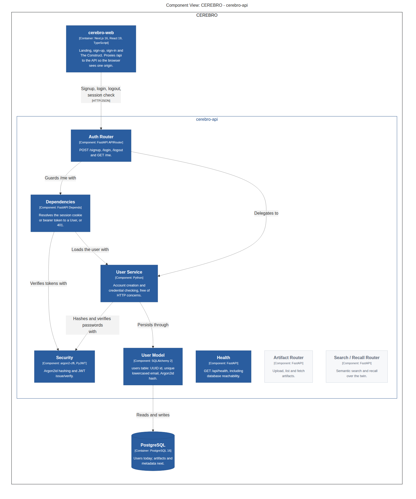
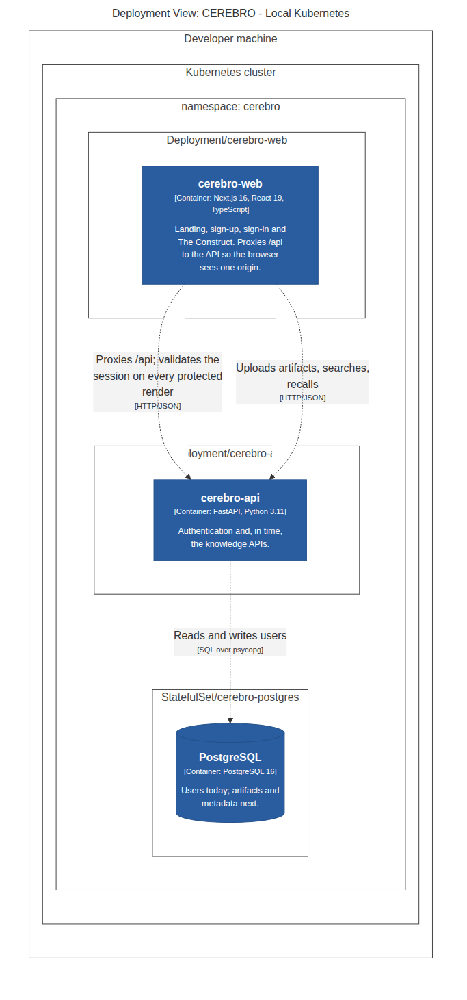

# CEREBRO — C4 Diagrams

Generated from `architecture/structurizr/workspace.dsl`, the single source of
truth. Do not hand-edit the diagrams; regenerate them:

```bash
make diagrams
```

Solid blue elements exist today. Pale grey elements are planned — see
`docs/ROADMAP.md`.

## Level 1 — System Context



## Level 2 — Containers

Three containers are built: `cerebro-web`, `cerebro-api` and PostgreSQL. The
rest of the system is drawn so the target shape is visible.



## Level 3 — Components of cerebro-api



## Deployment — local Kubernetes



## Exploring the model interactively

```bash
docker run -it --rm -p 8080:8080 \
  -v "$PWD/architecture/structurizr:/usr/local/structurizr" \
  structurizr/lite
```

Then open <http://localhost:8080>.
